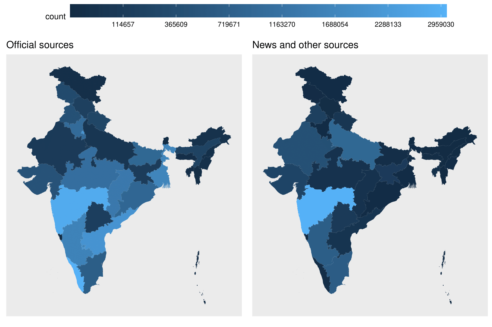

# Estimating the prevalence of Covid-19 in India from covid19india.org

This repository contains the code and data files that assemble and clean the raw data of covid affected people.

It also imports the geographical information from Wikipedia to use as covariates in the estimation.

It categorizes the source of data for each patient/affected person and can plot the variation geographically.

For example the following plot shows the differences in the number of documented cases by official sources and the media.

Uttar Pradesh and Rajasthan have more victims by the unofficial sources, whereas Delhi, Haryana, Kerala and the southeast have more victims in the official sources